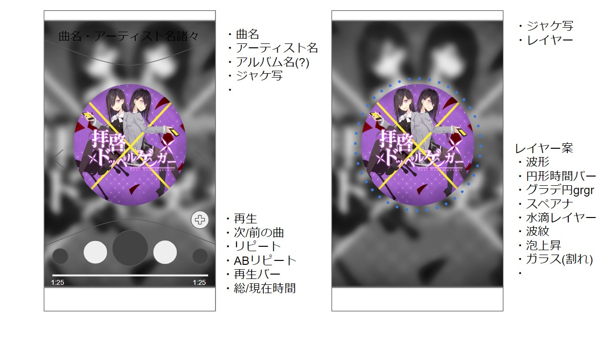

# クラス構造
## 各Widgetの実装方法
### 命名規則
* ロジックの部分: ``Logic_****.dart``
* 描画処理の部分: ``****Widget.dart``

### フォルダの階層
* なんとかWidget[Folder]
  * Widget[Folder]
    * ``なんとかWidget.dart``
    * ``サブWidget.dart``(ロジックと分ける必要があるときは，サブフォルダに記述)
  * Logic[Folder]
    * ``Logic_なんとか.dart``

# デザインのたたき台
## メイン

## リスト
まだなし

# クラス構造
## 基底クラス
### CustomizableWidget

# Function
## フォルダ探索
* 全探索
* フォルダ指定探索

## Player
* バックグランド再生（フォアグラウンド再生？）
ここはおそらくJavaの領域．
### Javaの処理呼び出すやつ
```dart
static abstract class HogeHogePlayer {
  const MethodChannel _methodChannel = const MethodChannel('quiche');

  static bool init (String path) async {
    result = await _methodChannel.invokeMethod(
      'init', <dynamic>[path]
    );

    return result;
  }

  static bool play () async {
    result = await _methodChannel.invokeMethod(
      'play', <dynamic>[]
    );

    return result;
  }

  static bool repeat (int startTime, int endTime) async {
    result = await _methodChannel.invokeMethod(
      'repeat', <dynamic>[startTime, endTime]
    );

    return result;
  } // みたいな感じ
}
```
