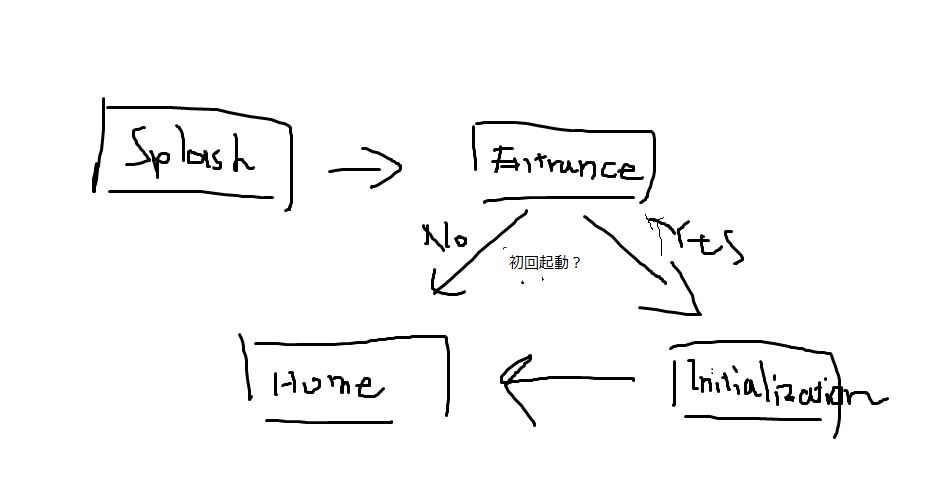
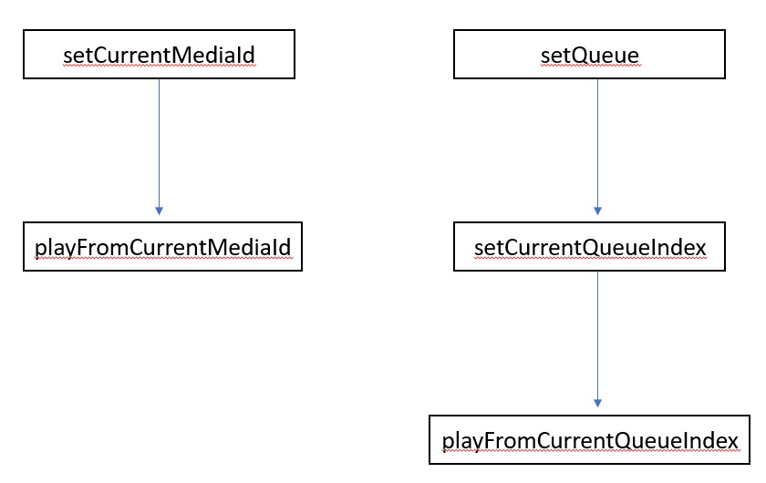

<!-- TOC -->

    - [0.0.1. <font size=5 color="red">* Widgetのリビルド最適化メモ *</font>](#001-font-size5-colorred-widgetのリビルド最適化メモ-font)
- [1. アプリの流れ](#1-アプリの流れ)
- [2. Splash](#2-splash)
  - [2.1. フォルダ](#21-フォルダ)
  - [2.2. 概要](#22-概要)
  - [2.3. 説明](#23-説明)
  - [2.4. どうすればええの？](#24-どうすればええの)
- [3. Entrance](#3-entrance)
  - [3.1. フォルダ](#31-フォルダ)
  - [3.2. 概要](#32-概要)
  - [3.3. 説明](#33-説明)
  - [3.4. どうすればええの？](#34-どうすればええの)
- [4. Initialization](#4-initialization)
  - [4.1. フォルダ](#41-フォルダ)
  - [4.2. 概要](#42-概要)
  - [4.3. 説明](#43-説明)
  - [4.4. どうすればええの？](#44-どうすればええの)
- [5. Home](#5-home)
  - [5.1. フォルダ](#51-フォルダ)
  - [5.2. 概要](#52-概要)
  - [5.3. 説明](#53-説明)
  - [5.4. どうすればええの？](#54-どうすればええの)
  - [5.5. CustomizableWidget クラス](#55-customizablewidget-クラス)
    - [5.5.1. 説明](#551-説明)
    - [5.5.2. overrideが必要なメソッド](#552-overrideが必要なメソッド)
- [6. QuicheOracle](#6-quicheoracle)
  - [6.1. ファイル](#61-ファイル)
  - [6.2. 概要](#62-概要)
  - [6.3. 説明](#63-説明)
    - [6.3.1. QuicheOracleVariables](#631-quicheoraclevariables)
    - [6.3.2. QuicheOracleFunctions](#632-quicheoraclefunctions)
- [7. PlatformMethodInvoker](#7-platformmethodinvoker)
  - [7.1. ファイル](#71-ファイル)
  - [7.2. 概要](#72-概要)
  - [7.3. 説明](#73-説明)
    - [7.3.1.](#731)
      - [7.3.1.1. どうすればええの？](#7311-どうすればええの)
    - [7.3.2.](#732)
      - [7.3.2.1. どうすればええの？](#7321-どうすればええの)
    - [7.3.3.](#733)
      - [7.3.3.1. どうすればええの？](#7331-どうすればええの)
    - [7.3.4.](#734)
      - [7.3.4.1. どうすればええの？](#7341-どうすればええの)
    - [7.3.5.](#735)
      - [7.3.5.1. どうすればええの？](#7351-どうすればええの)
    - [7.3.6.](#736)
      - [7.3.6.1. どうすればええの？](#7361-どうすればええの)
    - [7.3.7.](#737)
      - [7.3.7.1. どうすればええの？](#7371-どうすればええの)
    - [7.3.8.](#738)
      - [7.3.8.1. どうすればええの？](#7381-どうすればええの)
- [8. Music クラス](#8-music-クラス)
  - [8.1. 概要](#81-概要)
  - [8.2. 説明](#82-説明)
    - [8.2.1. プロパティ](#821-プロパティ)
      - [8.2.1.1. ``String id``](#8211-string-id)
      - [8.2.1.2. ``String title``](#8212-string-title)
      - [8.2.1.3. ``String artist``](#8213-string-artist)
      - [8.2.1.4. ``String album``](#8214-string-album)
      - [8.2.1.5. ``int duration``](#8215-int-duration)
      - [8.2.1.6. ``String artUri``](#8216-string-arturi)
      - [8.2.1.7. ``String path``](#8217-string-path)
    - [8.2.2. メソッド](#822-メソッド)
- [9. Enumerates](#9-enumerates)
  - [9.1. InitializationSection](#91-initializationsection)
  - [9.2. Permission](#92-permission)
  - [9.3. RouteName](#93-routename)
  - [9.4. SortType](#94-sorttype)

<!-- /TOC -->


### 0.0.1. <font size=5 color="red">* Widgetのリビルド最適化メモ *</font>
* O(1)でデータにアクセスできる[InheritedWidget](https://medium.com/flutter-jp/inherited-widget-37495200d965)
* Widgetの[const指定(Widgetのキャッシュ)](https://medium.com/flutter-jp/state-performance-7a5f67d62edd)
* [Performance considerations(Flutter.dev)](https://api.flutter.dev/flutter/widgets/StatefulWidget-class.html#performance-considerations)

# 1. アプリの流れ


# 2. Splash
## 2.1. フォルダ
QuicheSplash

## 2.2. 概要
アプリの印象をよくするためのアニメー朱恩．

## 2.3. 説明
``main.dart``の``_animateUntil``関数にて，Futureとして``delayed``とコンストラクタの引数である``someFuture``([ここで渡す](#main.dart))が両方とも終わるまでスプラッシュアニメーションを繰り返す．
## 2.4. どうすればええの？
* ``someFuture``を渡して，
* Futureが両方終わるまでのアニメーションを``build``関数に定義すればよい．


# 3. Entrance
## 3.1. フォルダ
QuicheEntrance

## 3.2. 概要
アプリの玄関．

## 3.3. 説明
``QuicheOracleFunctions.checkInitialization``([ここで定義する](#quicheoraclefunctions))関数でアプリ既に初期化されたか(初回起動時かどうか，もしくは正常に初期化されたか，のほうが安全？)を見て，
* ``true``なら[Home](#home)に行き，
* ``false``なら[Initialization](#initialization)に行く．

## 3.4. どうすればええの？
``QuicheOracleFunctions.checkInitialization``の中身を頑張る．


# 4. Initialization
## 4.1. フォルダ
QuicheInitialization

## 4.2. 概要
アプリの初期化．

## 4.3. 説明
``IQuicheInitialization``の継承クラスを``_sectionMap``に挿入し，``onSuccess``や``onError``等に基づき初期化が構成される．

## 4.4. どうすればええの？
* 現状``RequestPermissionsSection``だけなので，
* なにも考えなくてよいで宇s．


# 5. Home
## 5.1. フォルダ
QuicheHome

## 5.2. 概要
アプリのメイン画面．

## 5.3. 説明
<font size="5">**今のところ，何も考えてません！**</font>

## 5.4. どうすればええの？
* **曲リストとか再生画面とか**
* **ここがアプリの見せどころ**
* ``QuicheOracle``([これです](#quicheoracle))や``PlatformMethodInvoker``([これです](#platformmethodinvoker))を駆使して頑張ってください！
* **``CurstomizableWidget``(再生画面にてStackするWidget)を作る場合は，``CurstomizableWidget``([これです](#customizablewidget))を継承してください！**

## 5.5. CustomizableWidget クラス
### 5.5.1. 説明
* 再生画面にてLayerするWidgetの基底クラス．
### 5.5.2. overrideが必要なメソッド
```dart
// return a serialized setting
Map<String, dynamic> get setting;
```
Layerを表現する設定をJSON形式で取得できるゲッター．

```dart
set setting (Map<String, dynamic> importedSetting);
```
Layerを表現する設定をインポートするためのセッター．

# 6. QuicheOracle
## 6.1. ファイル
``QuicheOracle.dart``

## 6.2. 概要
アプリの汎用インターフェース．

## 6.3. 説明
### 6.3.1. QuicheOracleVariables
```dart
static double screenWidth;
```
今は何も考えてない
```dart
static double screenHeight:
```
今は何も考えてない
```dart
static List<Music> musicList;
```
ここにネイティブから取得したメディアの情報を保持する``Music``クラスが詰まっています．
```dart
static final Map<Permission, bool> permissionInformation;
```
パーミッション情報です．**触れるな危険**
```dart
static Future<Directory> get serializedJsonDirectory async
```
今は何も考えてない．ここに``CustomizableWidget``のセッティングJSONを入れたい


### 6.3.2. QuicheOracleFunctions
```dart
static Future<bool> checkInitialization ()
```
アプリが初回起動かどうか(アプリが正常に初期化されたかどうか)を判定する関数．
```dart
static List<dynamic> getSortedMusicList (SortType sortType)
```
``SortType``enumに応じてソートしたミュージックのリストを返します．
  - **考えなければならないこと**
  ``Music``クラスは現状**1曲単位**です．例としてアルバムソートの場合，多数の
  ``Music``クラスをhasした``Album``クラス等を考えてみると酔うかもしれません．


# 7. PlatformMethodInvoker


## 7.1. ファイル
``PlatformMethodInvoker.dart``

## 7.2. 概要
androidネイティブAPIを呼び出す関数が多数勢ぞろい

## 7.3. 説明
* * *
### 7.3.1.  
```dart
static Future<List<bool>> requestPermissions (List<Permission> permissions) async
```
パーミッションを要求します．acceptされれば``true``，denyされれば``false``がそれぞれ戻り値のリストに格納されます．
#### 7.3.1.1. どうすればええの？
パーミッションを必要としない限り，呼ぶ必要はありません．

* * *
### 7.3.2.  
```dart
static Future<bool> trigger () async
```
MediaBrowserServiceをアプリにバインドします．
#### 7.3.2.1. どうすればええの？
Homeの起動時に呼ばれるものです．気にする必要はありません．

* * *
### 7.3.3.  
```dart
static Future<List<Music>> butterflyEffect () async
```
ネイティブから再生できるミュージックを全て取得します．
#### 7.3.3.1. どうすればええの？
Homeに来た時点で既に``QuicheOracleFunctions.musicList``に全て格納されています．気にする必要はありません．
**取得する属性を追加したい場合は，Javaコードを変更する必要があります．！**

* * *
### 7.3.4.  
```dart
static Future<Null> setQueue (List<String> mediaIdList) async
```
``Music``クラスの``id``プロパティのリストを引数にして，それに対応するキューをネイティブで作成します．
#### 7.3.4.1. どうすればええの？
たとえば，アルバムをクリックした場合，キューにアルバム内の``Music``の``id``を順番に入れる必要があります．

* * *
### 7.3.5.  
```dart
static Future<Null> setCurrentMediaId (String mediaId) async
```
``playFromCurrentMediaId``を呼び出す前に，この関数を呼び出して準備します．引数には``Music``クラスの``id``を指定します．
#### 7.3.5.1. どうすればええの？
正しく使ってください．

* * *
### 7.3.6.  
```dart
static Future<Null> setCurrentQueueIndex (int index) async
```
``playFromCurrentQueueIndex``を呼び出す前に，この関数を呼び出して準備します．引数には用意したキューのインデックスを指定します．
#### 7.3.6.1. どうすればええの？
当然``setQueue``でキューを指定していなければ，エラーとなります．気をつけてください．

* * *
### 7.3.7.  
```dart
static Future<Null> playFromCurrentMediaId () async
```
現在セットされている``id``に対応するメディアを再生します．
#### 7.3.7.1. どうすればええの？
正しく使ってください．

* * *
### 7.3.8.  
```dart
static Future<Null> playFromCurrentQueueIndex () async
```
現在セットされているキューのインデックスに対応するメディアを再生します．
#### 7.3.8.1. どうすればええの？
正しく使ってください．


# 8. Music クラス
```dart
  Music ({
    @required String id,
    @required String title,
    @required String artist,
    @required String album,
    @required int duration,
    @required String artUri,
    @required String path
  })
```
## 8.1. 概要
**1曲分**の情報が入っているクラス．

## 8.2. 説明
### 8.2.1. プロパティ
#### 8.2.1.1. ``String id``
再生する際に用いる，一意なIDです．
#### 8.2.1.2. ``String title``
タイトルです．
#### 8.2.1.3. ``String artist``
アーティスト名です．
#### 8.2.1.4. ``String album``
アルバム名です．
#### 8.2.1.5. ``int duration``
曲の長さ(ミリ秒)です．
#### 8.2.1.6. ``String artUri``
ジャケット画像のパスです．**ない場合は，nullです.**``chooseArtUri``を使用して下さい．
#### 8.2.1.7. ``String path``
曲ファイルのパスです．

### 8.2.2. メソッド
```dart
String chooseArtUri ({String format = 'png'})
```
* ``artUri != null``なら``artUri``を返し，
* 曲名に対応する画像があればそのパスを返し，
* アルバム名に対応する画像があればそのパスを返し，
* ファイル名に対する画像があればそのパスを返し，
* それでもなければ**null**を返します．


# 9. Enumerates
## 9.1. InitializationSection
```dart
  RequestPermissions,
  None
```
## 9.2. Permission
```dart
  READ_EXTERNAL_STORAGE
```
## 9.3. RouteName
```dart
  Splash,
  Entrance,
  Initialization,
  Home
```
* extension メソッド
```dart
  String get name {
    switch (this) {
      case RouteName.Splash: {
        return '/';
      }
      case RouteName.Entrance: {
        return '/entrance';
      }
      case RouteName.Initialization: {
        return '/initialization';
      }
      case RouteName.Home: {
        return '/home';
      }
    }
  }
```
## 9.4. SortType
```dart
  TITLE_ASC,
  ARTIST_ASC,
  ALBUM_ASC,
  TITLE_DESC,
  ARTIST_DESC,
  ALBUM_DESC
```